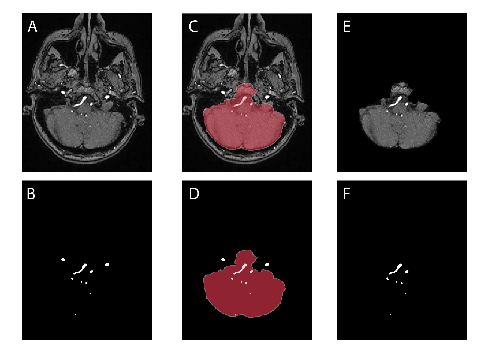
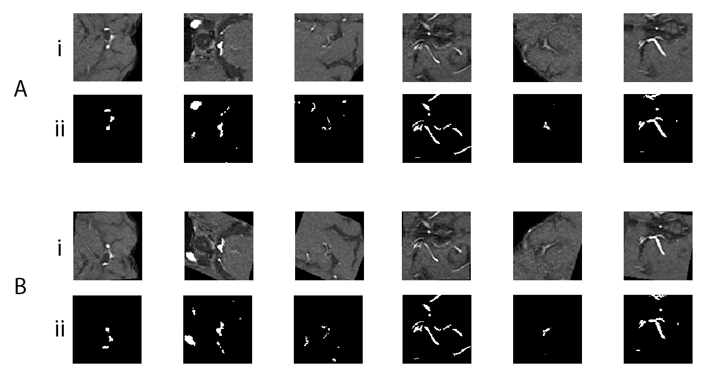
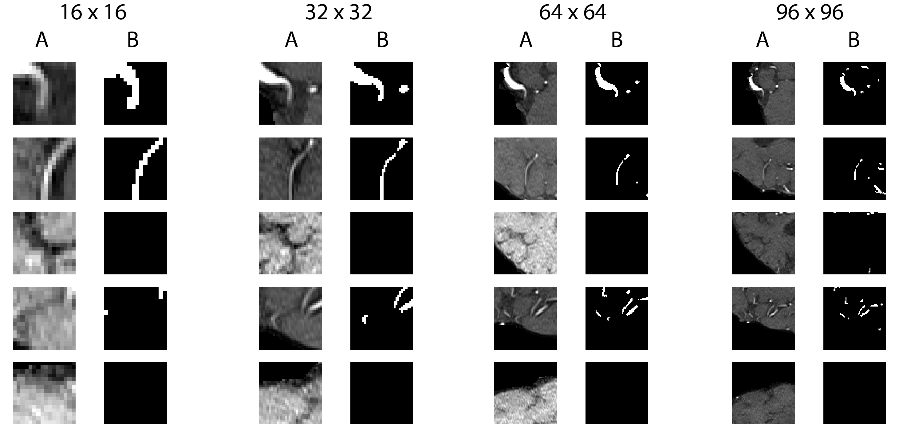
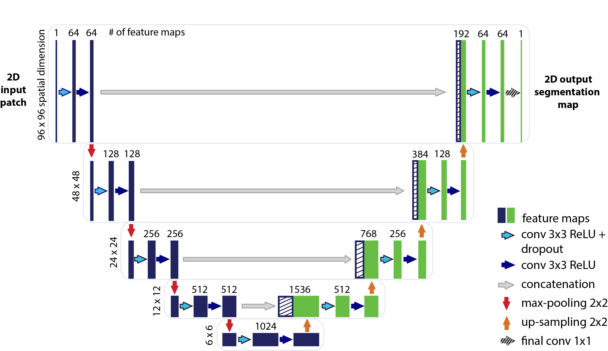
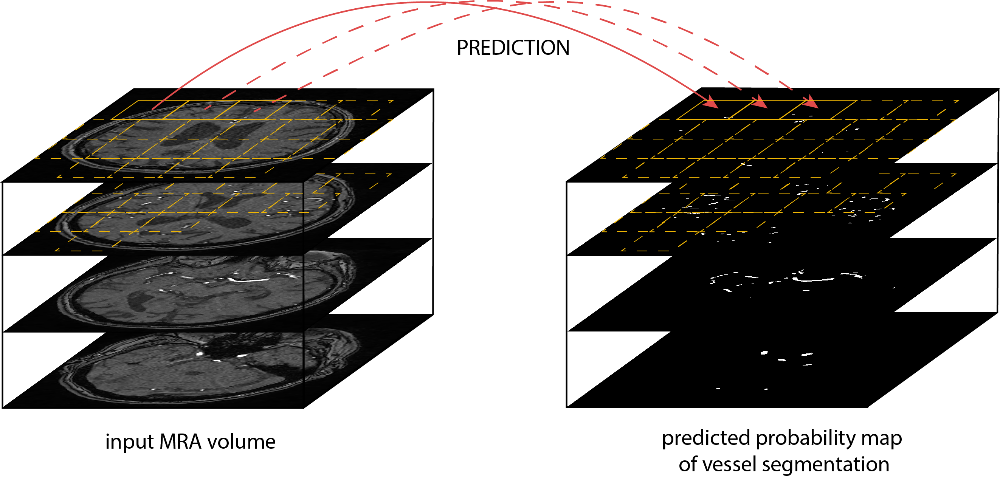
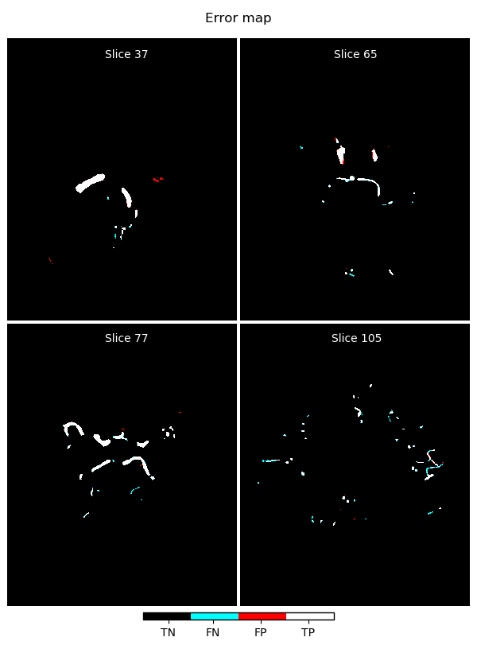
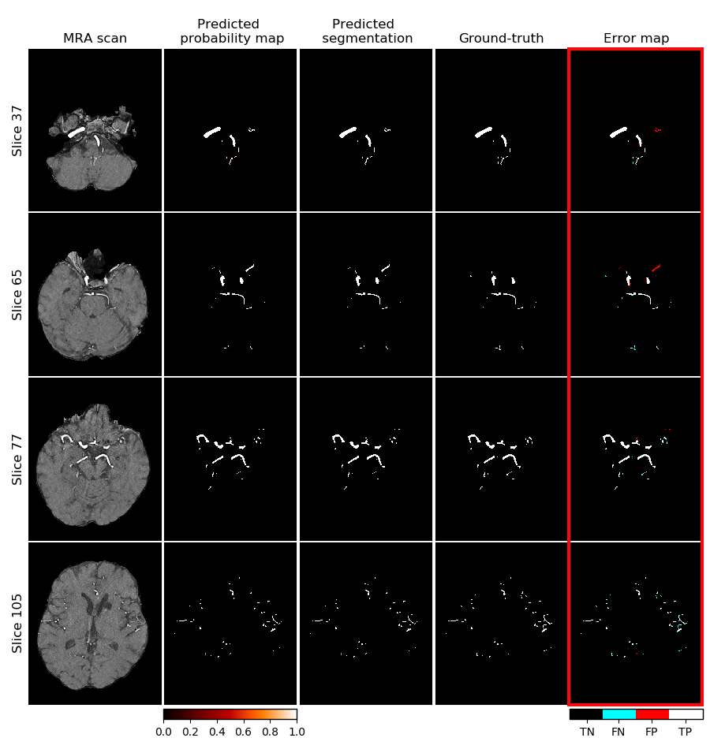
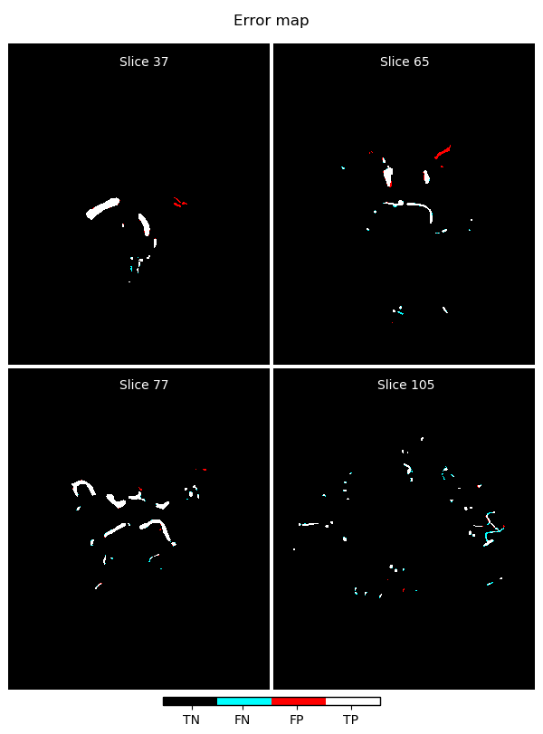

# A U-Net Deep Learning Framework for High Performance Vessel Segmentation in Patients With Cerebrovascular Disease

This repository contains the implementation of the U-net framework for fully automated arterial brain vessel segmentation evaluated on a dataset of 66 magnetic resonance (MR) images of patients with cerebrovascular disease.
The neural network structure is derived from the *U-Net* architecture presented by [Ronneberger et al. (2015)](https://arxiv.org/pdf/1505.04597.pdf).

## Overview

https://www.frontiersin.org/articles/10.3389/fnins.2019.00097/full

If you use the code or the models, please cite our work as:

Livne, Michelle et al. „A U-Net Deep Learning Framework for High Performance Vessel Segmentation in Patients With Cerebrovascular Disease“. Frontiers in Neuroscience, Bd. 13, Februar 2019, S. 97. DOI.org (Crossref), doi:10.3389/fnins.2019.00097.

## Models

The models can be downloaded via this link:
https://zenodo.org/record/3433818#.XYENBJMza1s

## Data
We used imaging data from patients from the PEGASUS study that enrolled patients with steno-occlusive cerebrovascular disease. At the current time-point the imaging data cannot be made publicly accessible due to data protection.

**Input**: MRA 3D scans  
**Output**: Binary 3D images of vessels  

## Methods

### Data splitting:
For rough grid parameter tuning:  
30 patients. 
The data was split patient-wise to training/validation/test set. Each set includes 18/5/7 patients respectively.

For fine grid parameter tuning:  
66 patients.
The data was split patient-wise to training/validation/test set. Each set includes 41/11/14 patients respectively.

### Skull stripping:
Removal of the skull and other non-brain tissues from the denoised MRA images by applying the brain mask to the images.

The denoised MRA scans (A) and the ground-truth labels (B) are overlaid with the brain mask (C and
D) resulting in masked brain images (E) and ground-truth labels (F).

### Data Augmentation:
The training data (training patches) was augmented on-the-fly with a [ImageDataGenerator](https://keras.io/preprocessing/image/) from Keras library.
The augmentation contained random flipping over vertical axis, random rotation in range -30° to 30° and random shear in range -20° to 20°. The augmentation doubled the number of training patches.

The figure shows training patches augmented by random rotations in range from -30° to 30°, random shears in range from -20° to 20° and random vertical flips. The upper part of the figure shows the original patches (A) of brain-images (i) and corresponding ground-truth labels (ii). The lower part of the figure shows the augmented patches (B) of brain images (i) and the corresponding labels (ii).

### Patch extraction:
We extracted 1000 quadratic patches per patient: 500 random patches with a vessel in the center and 500 random patches without a vessel in the center. 4 different sizes (16, 32, 64, 96) of patches were extracted. The model was trained using 4 different patch sizes (16 × 16, 32 × 32, 64 × 64, 96 × 96 voxels) and was later tested for best results against the validation set as part of the optimization process.

The figure shows five pairs of randomly extracted patches from a brain image (A) of a representative patient and ground-truth label (B) in 4 different patch sizes: 16 x 16, 32 x 32, 64 x 64 and 96 x 96 voxels. Each row corresponds to one area with different patch sizes.

### Patch-based normalization: 
The data was normalized patch-wise using zero-mean and unit-variance normalization by subtracting the mean and dividing by the standard deviation as calculated for the training-, validation -and test sets respectively.

### Unet architecture
The U-net CNN model architecture was adapted from the framework presented by [Ronneberger et al. (2015)](https://arxiv.org/pdf/1505.04597.pdf).
The contracting path (encoding part, left side) repeatedly applies two 3x3 convolutions layers followed by 2x2 pooling layer on 4 levels and reduces the height and width of the input images. The bottom level includes two 3x3 convolution layers without pooling layer. The expansive path (decoding part, right side) recovers the original dimensions of the input images by up-sampling of the feature channels and concatenation with the corresponding feature channels from contractive path. On each level of the 4 levels in the expansive path there are again two 3x3 convolutional layers applied in sequence. 
Each convolutional layer is followed by ReLU and has 3x3 kernel, strides (1,1).
Max pooling layers has 2x2 kernel, strides (2,2).
The final layer is a 1x1 convolution for mapping the feature channels from previous layer to binary probabilities. The network is fed with 2D image patches and returns the 2D segmentation probability map for each given patch.

Two architectures were trained:
1. **Full unet** with full number of feature channels on 5 layers [64, 128, 256, 512, 1024] respectively. This architecture has 31 377 793 trainable parameters (weights).

 

2. **Half unet** with half number of feature channels on 5 layers [32, 64, 128, 256, 512] respectively. This architecture has 7 846 081 trainable parameters (weights).

### Model training
Optimizer: Adam  
Activation functions after each convolution layer: ReLU f(x) = max(0,x)  
Activation function after the final layer: sigmoid sigma(x) = 1/(1+e^(-x))  
Performance measure: DICE coefficient =  2 * (TP / (2 * TP + FP + FN))  
Loss function: DICE loss = -2 * (TP + smooth / (2 * TP + FP + FN + smooth)), smooth = 1  
The smoothing factor ensures that the measure value is equal to 1.0 if the prediction and ground truth are empty.

### Performance assessment
The evaluation of the model on the validation and test sets done on the fully constructed brain level. The full brain for each patient is divided in patches one by one; for each patch the segmentation is predicted; and the predictions are stacked again together to return the final full volume. The performance measures for each set (validation / test) was calculated as average over all patients in the particular set.

The model performance was assessed based on three different measures: The Dice coefficient, 95HD and the AVD. The measures were calculated using the EvaluateSegmentation tool provided by [Taha and Hanbury (2015), Taha (2018)](https://bmcmedimaging.biomedcentral.com/articles/10.1186/s12880-015-0068-x). 

## Results

### Models chosen on the best values in validation set:
1. **Unet - full feature channels**: [64, 128, 256, 512, 1024]:
    * patch size 96, epochs 10, batch size 16, lr 1e-4, dr 0: DICE val-set 0.882, test-set 0.891
    * patch size 96, epochs 10, batch size 64, lr 1e-4, dr 0: HDRFDST-0.95 val-set 47.121, test-set 47.277
    * patch size 96, epochs 10, batch size 8, lr 1e-5, dr 0: AVGDIST val-set 0.410, test-set 0.342

Exemplary segmentation with the full Unet model selected on DICE:

Enlarged error map from previous figure:

2. **Unet - half feature channels**: [32, 64, 128, 256, 512]:
    * patch size 96, epochs 10, batch size 64, lr 1e-4, dr 0.1: DICE val-set 0.881, test-set 0.892
    * patch size 96, epochs 10, batch size 32, lr 1e-4, dr 0.2: HDRFDST-0.95 val-set 47.298, test-set 47.099
    * patch size 96, epochs 10, batch size 32, lr 1e-4, dr 0.1: AVGDIST val-set 0.436, test-set 0.385

Exemplary segmentation with the half Unet model selected on DICE:

Enlarged error map from previous figure:

### Threshold Analysis
The threshold analysis was done to ensure that the applied threshold on the classifier output (to shift to binary prediction) is optimized. 

The code "threshold_analysis" calculates calibration plots that showed that the output is not calibrated. Therefore optimized threshold to maximize F1-score on the validation set was identified. 

Based on that threshold new performance assessment was done on the test-set, but since it yielded no difference (due to the highly marginal output concentration, i.e. probabilities near 0 and 1, not many in the "grey zone"), the default 0.5 threshold was used.

## Manual
Manual to this framework can be found [here](manual.md).

## License
This project is licensed under the [MIT license](LICENSE.md).
